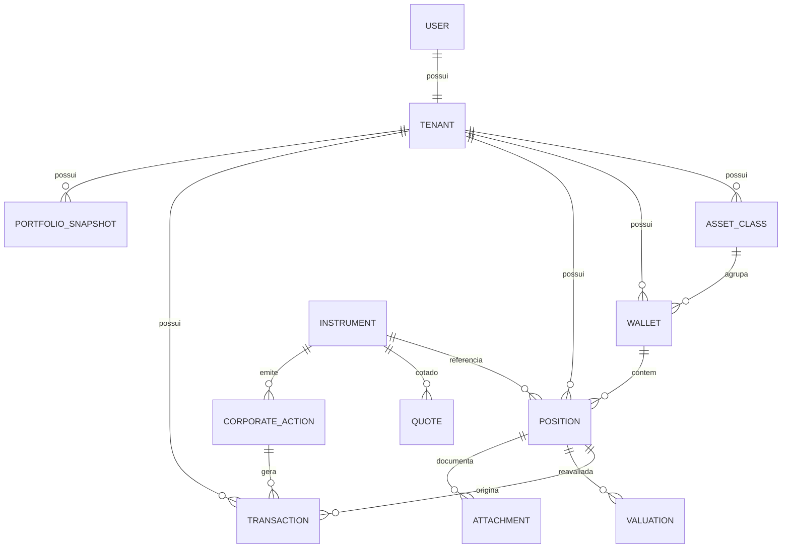

# 01 — Arquitetura Técnica

---

## 1. Stack

| Camada | Escolha | Por quê |
|---|---|---|
| Framework | **Next.js 15** (App Router, RSC, Server Actions) | Renderização no servidor para números pesados, cliente leve para animação |
| Linguagem | **TypeScript** strict | Contratos de domínio explícitos |
| Banco | **Postgres** (Supabase) | `numeric` nativo, JSONB, RLS, window functions para o ledger |
| ORM | **Drizzle ORM** | SQL-first, migrations versionadas, tipos gerados; não esconde o SQL que importa |
| Auth | **Supabase Auth** | JWT com `tenant_id` em custom claim, alimentando o RLS |
| Storage | **Supabase Storage** | Fotos de imóveis e documentos, com policies por tenant |
| Estilo | **Tailwind CSS v4** + tokens CSS | Tokens no `@theme`, zero CSS-in-JS em runtime |
| Componentes | **shadcn/ui** (base) + camada própria | Código no repositório, sem dependência de tema de terceiros |
| Animação | **Motion** (`motion/react`) | Só `transform` e `opacity`; layout animations |
| Gráficos | **Recharts** com camada de tema própria | Controle total sobre gradiente, glow e tooltip |
| Estado servidor | **TanStack Query** | Cache, revalidação, optimistic updates |
| Formulários | **React Hook Form + Zod** | O mesmo schema Zod valida o formulário dinâmico e a Server Action |
| Valores monetários | **decimal.js** | `float` nunca toca dinheiro |
| Jobs | **Supabase Cron** (pg_cron) + rotas `/api/jobs/*` | Cotações, snapshots, sync de proventos |
| Testes | **Vitest** (domínio) + **Playwright** (fluxos) | O motor de cálculo tem cobertura obrigatória |

---

## 2. Camadas

Regra: **as dependências apontam sempre para dentro.** O domínio não conhece
React, não conhece Supabase, não conhece HTTP.

```
┌──────────────────────────────────────────────────────────┐
│  APRESENTAÇÃO   app/ + components/                       │
│  RSC, telas, design system, animação. Não calcula nada.  │
├──────────────────────────────────────────────────────────┤
│  APLICAÇÃO      server/actions/ + server/queries/        │
│  Server Actions, orquestração, autorização, validação Zod│
├──────────────────────────────────────────────────────────┤
│  DOMÍNIO        core/                                    │
│  Ledger, valoração, proventos, rentabilidade.            │
│  TypeScript puro. Testável sem banco. O coração.         │
├──────────────────────────────────────────────────────────┤
│  INFRAESTRUTURA db/ + integrations/                      │
│  Drizzle, Supabase, providers de cotação, storage        │
└──────────────────────────────────────────────────────────┘
```

**Por que isso importa aqui:** o cálculo de preço médio, lucro realizado e
proventos é a parte do sistema onde um bug custa a confiança do usuário. Ela
precisa rodar em testes unitários rápidos, sem banco e sem browser.

---

## 3. Multitenancy

Isolamento em **duas camadas independentes**. Se a aplicação falhar, o banco segura.

### Camada 1 — Aplicação
- Toda tabela de negócio tem `tenant_id NOT NULL`.
- Toda query passa por um helper `withTenant()` que injeta o filtro.
- Um teste automatizado varre o schema e falha se alguma tabela de negócio não
  tiver `tenant_id`.

### Camada 2 — Banco (RLS)
Row Level Security ligado em **todas** as tabelas de tenant. O `tenant_id` viaja
no JWT como custom claim.

```sql
alter table position enable row level security;

create policy tenant_isolation on position
  using (tenant_id = (auth.jwt() ->> 'tenant_id')::uuid);
```

### Modelo de tenant — **um usuário por tenant**

```
user  1 ──── 1  tenant  1 ──── N  (todo o resto)
```

Decisão: **sem tabela `membership`**. Cada usuário tem exatamente um tenant,
criado no signup por trigger. `tenant.owner_user_id` guarda o dono.

O que **não** muda: `tenant_id` continua em toda tabela de negócio e o RLS
continua ligado. É isso que preserva o caminho para o multiusuário — se um dia
existir "convidar membro", basta introduzir `membership` e trocar a fonte do
claim. Nenhum dado precisa migrar, nenhuma query precisa ser reescrita.

O que se ganha agora: uma tabela e um join a menos em todo lugar, e uma policy
de RLS mais simples.

### Dados globais (sem tenant)
`instrument`, `quote`, `corporate_action`, `fx_rate` são **compartilhados**.
Uma cotação de BTC serve todos os tenants. Leitura pública autenticada, escrita
apenas via service role.

---

## 4. Modelo de dados

### 4.1 ERD



### 4.2 Tabelas

#### `tenant`
| coluna | tipo | nota |
|---|---|---|
| id | uuid PK | |
| owner_user_id | uuid FK → `auth.users` | único; um usuário, um tenant |
| name | text | |
| base_currency | text | `BRL` |
| settings | jsonb | preferências, incl. `showAdvancedReturns` |
| created_at | timestamptz | |

#### `asset_class`
A classe define **como o ativo é avaliado** e **quais campos ele tem**.

| coluna | tipo | nota |
|---|---|---|
| id | uuid PK | |
| tenant_id | uuid FK | null = classe de sistema (seed), visível a todos |
| slug | text | `acoes-br`, `cripto`, `imoveis` |
| name | text | |
| valuation_mode | enum | `QUANTITATIVE` \| `VALUATED` \| `ACCRUAL` |
| supports_dividends | boolean | liga o motor de proventos |
| field_schema | jsonb | **campos dinâmicos da classe** |
| icon | text | nome do ícone Lucide |
| color | text | cor de destaque nos gráficos |
| sort_order | int | |

`field_schema` — exemplo para Imóveis:
```json
{
  "fields": [
    { "key": "area",     "label": "Área (m²)", "type": "number" },
    { "key": "city",     "label": "Cidade",    "type": "text" },
    { "key": "state",    "label": "Estado",    "type": "select", "options": ["SP","RJ","MG"] },
    { "key": "rent",     "label": "Valor do aluguel", "type": "money" },
    { "key": "notes",    "label": "Observações", "type": "textarea" }
  ]
}
```
Um único componente `<DynamicFieldForm schema={...} />` renderiza qualquer
classe. Criar uma classe nova nunca exige deploy.

#### `wallet`
| coluna | tipo | nota |
|---|---|---|
| id, tenant_id | uuid | |
| asset_class_id | uuid FK | |
| name | text | "Binance", "XP", "Ledger" |
| kind | enum | `BROKER` \| `EXCHANGE` \| `SELF_CUSTODY` \| `BANK` \| `OTHER` |
| metadata | jsonb | rede, endereço público, agência |

#### `instrument` — catálogo global
| coluna | tipo | nota |
|---|---|---|
| id | uuid PK | |
| symbol | text | `BTC`, `BBAS3`, `AAPL` — canônico, upper |
| name | text | |
| kind | enum | `STOCK` \| `FII` \| `ETF` \| `CRYPTO` \| `FIXED_INCOME` \| `CUSTOM` |
| currency | text | moeda de negociação |
| exchange | text | `B3`, `NASDAQ`, `BINANCE` |
| external_ids | jsonb | `{ "coingecko":"bitcoin", "brapi":"BBAS3" }` |
| is_global | boolean | `false` = instrumento privado do tenant (imóvel, empresa) |
| tenant_id | uuid null | preenchido só quando `is_global = false` |

> Imóveis e empresas viram instrumentos **privados do tenant**. Assim o resto do
> sistema trata tudo de forma uniforme, sem `if (é imóvel)` espalhado no código.

#### `position` — o ativo dentro de uma carteira
| coluna | tipo | nota |
|---|---|---|
| id, tenant_id | uuid | |
| wallet_id | uuid FK | |
| instrument_id | uuid FK | |
| custom_fields | jsonb | valores do `field_schema` da classe |
| opened_at | date | |
| closed_at | date null | posição zerada |

**Colunas derivadas (materializadas, nunca editáveis pelo usuário):**
`quantity`, `avg_price`, `total_cost`, `realized_pnl`, `income_total`.
Recalculadas pelo motor a cada mutação no ledger. Existem por performance —
a verdade continua sendo o ledger. Um comando `recompute` reconstrói tudo do zero.

*Restrição:* `unique (wallet_id, instrument_id)` — um ativo aparece uma vez por
carteira. A consolidação acontece na leitura.

#### `transaction` — **o ledger, fonte da verdade**
| coluna | tipo | nota |
|---|---|---|
| id, tenant_id | uuid | |
| position_id | uuid FK | |
| type | enum | ver abaixo |
| occurred_at | timestamptz | data do fato, não do cadastro |
| quantity | numeric(28,10) | |
| unit_price | numeric(28,10) | |
| gross_amount | numeric(28,10) | |
| fees | numeric(28,10) | corretagem, taxa de rede |
| taxes | numeric(28,10) | IR retido no JCP |
| net_amount | numeric(28,10) | |
| currency | text | moeda original |
| fx_rate | numeric(28,10) | para a moeda base, na data |
| source | enum | `MANUAL` \| `IMPORT` \| `AUTO_CORPORATE_ACTION` |
| corporate_action_id | uuid null | rastreia o provento automático |
| transfer_group_id | uuid null | liga as duas pernas de uma transferência |
| idempotency_key | text unique | impede duplicata |
| notes | text | |
| deleted_at | timestamptz null | soft delete |

**Tipos de transação:**

| Grupo | Tipos | Efeito |
|---|---|---|
| Posição | `BUY`, `SELL` | altera qtd e custo |
| Movimentação | `TRANSFER_IN`, `TRANSFER_OUT` | altera qtd, **preserva preço médio, não gera lucro** |
| Proventos | `DIVIDEND`, `JCP`, `INCOME`, `RENT`, `INTEREST`, `STAKING` | não altera qtd, alimenta renda passiva |
| Eventos | `SPLIT`, `REVERSE_SPLIT`, `BONUS` | ajusta qtd e preço médio, valor total constante |
| Provisão | `ACCRUAL` | juros acumulados de renda fixa e empréstimos |

> Reavaliação de imóvel/empresa **não** é transação — não move dinheiro nem
> quantidade. Vive na tabela `valuation`, abaixo. O ledger registra fatos
> econômicos; a reavaliação é uma opinião de valor.

#### `valuation` — reavaliações
`position_id`, `valued_at`, `value`, `currency`, `method` (`MANUAL` \| `APPRAISAL`
\| `MARKET`), `notes`. Alimenta o modo `VALUATED`.

#### `quote` — cotações (global)
`instrument_id`, `price`, `currency`, `as_of`, `provider`.
Índice `(instrument_id, as_of desc)`. Última cotação e série histórica.

#### `fx_rate` — câmbio (global)
`base`, `quote`, `rate`, `as_of`. Ex.: `USD/BRL`.

#### `corporate_action` — eventos corporativos (global)
| coluna | nota |
|---|---|
| instrument_id | |
| type | `DIVIDEND` \| `JCP` \| `BONUS` \| `SPLIT` \| `REVERSE_SPLIT` \| `INCOME` |
| ex_date | **data-com** — define quem tem direito |
| payment_date | data do pagamento |
| value_per_share | |
| ratio | para split/grupamento/bonificação |
| currency, provider, raw | |

#### `portfolio_snapshot` — evolução patrimonial
`tenant_id`, `date`, `total_value`, `total_cost`, `total_income`,
`breakdown` (jsonb: valor por classe). Um por tenant por dia.

#### `attachment`
`position_id`, `storage_path`, `kind` (`PHOTO` \| `DOCUMENT`), `filename`,
`size`, `mime`. Policies de Storage por `tenant_id`.

---

## 5. Motor de domínio (`core/`)

### 5.1 Ledger — cálculo de posição

```ts
// core/ledger/compute-position.ts
export function computePosition(txs: Transaction[]): PositionState
```

Percorre as transações em ordem cronológica e produz
`{ quantity, avgPrice, totalCost, realizedPnl, incomeTotal }`.

Regras:
- **Custo médio ponderado** (padrão brasileiro), não FIFO.
- `BUY` → `custo += qtd × preço + taxas`; `qtd += qtd`
- `SELL` → `lucro realizado += (preço venda − preço médio) × qtd − taxas`;
  `custo −= preço médio × qtd`; **preço médio não muda**
- `TRANSFER_*` → move quantidade **e** custo proporcional entre posições.
  Nunca gera lucro.
- `SPLIT ratio=r` → `qtd ×= r`; `preço médio ÷= r`; custo total inalterado
- `BONUS` → aumenta qtd sem aumentar custo → preço médio cai
- Proventos → não tocam qtd nem custo; acumulam em `incomeTotal`

Função **pura**. Sem I/O. Coberta por testes de tabela com casos reais
(desdobramento da PETR4, bonificação, venda parcial, transferência entre
exchanges).

### 5.2 Valoração

```ts
interface ValuationStrategy {
  currentValue(position: PositionState, ctx: MarketContext): Decimal
}
```
Três implementações: `QuantitativeValuation` (qtd × cotação),
`ValuatedValuation` (última `valuation`), `AccrualValuation`
(principal + juros pro rata até hoje). A classe escolhe a estratégia.

### 5.3 Motor de proventos

O fluxo que entrega a feature mais valiosa do produto:

```
1. Sync (job)      → busca corporate_actions dos instrumentos que
                     ao menos um tenant possui
2. Match           → para cada evento, reconstrói a quantidade que o
                     tenant tinha na ex_date, por posição, a partir do ledger
3. Gera            → cria transaction de provento com
                     idempotency_key = hash(position, corporate_action)
4. Reprocessa      → SPLIT/BONUS disparam recompute da posição e de
                     todos os eventos posteriores
```

O passo 2 é o motivo pelo qual o ledger existe. Sem histórico de transações,
é impossível saber quanto o usuário tinha na data-com.

**Degradação graciosa:** se o provider não cobrir um evento, o usuário lança
manualmente. A UI nunca promete cobertura total — mostra a origem do dado
(`automático` / `manual`) em cada provento.

### 5.4 Integrações — interface única

```ts
interface PriceProvider {
  readonly name: string
  supports(instrument: Instrument): boolean
  getQuotes(instruments: Instrument[]): Promise<Quote[]>
  getCorporateActions?(i: Instrument, from: Date): Promise<CorporateAction[]>
}
```

| Provider | Cobre | TTL do cache |
|---|---|---|
| `BrapiProvider` | Ações BR, FIIs, ETFs BR, eventos corporativos | 15 min (pregão) / 12 h |
| `CoinGeckoProvider` | Criptomoedas | 60 s |
| `YahooProvider` | Stocks, ETFs internacionais, câmbio | 15 min / 12 h |
| `ManualProvider` | Imóveis, empresas, alternativos | — |

### 5.5 Logos dos ativos

O logo é atributo do **instrumento**, não da posição, e vive no catálogo global
(`instrument.logo_url`). Uma busca serve todos os tenants, como a cotação.
Resolvido no job de sincronização, com TTL de 30 dias — marca muda, mas não toda
semana. Contrato em `integrations/providers/logo.ts`.

| Classe | Fonte | Campo |
|---|---|---|
| Criptomoedas | CoinGecko | `image.large` de `/coins/markets` |
| Ações BR, FIIs, ETFs | BRAPI | `logourl` de `/quote/{ticker}` |
| Stocks, ETFs int. | provider internacional | a definir na Fase 4 |
| Renda Fixa, Imóveis, Empréstimos, Alternativos, Empresas, Outros | — | não existe marca |

Três coisas que **não** se faz aqui:

1. **Buscar logo no browser a cada render.** Vira dezenas de requisições por
   tela, estoura rate limit e atrasa a pintura da tabela.
2. **Montar a URL por convenção a partir do ticker.** Os CDNs usam IDs internos
   (o Bitcoin é `/coins/images/1/…` no CoinGecko, não `/bitcoin`), então
   adivinhar o caminho produz imagem quebrada em silêncio.
3. **Redesenhar a marca como SVG no projeto.** Logo de empresa é marca
   registrada; recriar Apple, Vale ou Petrobras à mão é problema jurídico, não
   atalho de design.

`AssetAvatar` degrada para um monograma tingido pela cor da classe quando não há
logo — ou quando ele falha em carregar. Nas classes sem marca, esse monograma
não é estado degradado: é a aparência final.

Um `ProviderRegistry` roteia por instrumento, agrupa em lote, respeita rate
limit e cai para o último preço conhecido em caso de falha. **Nenhuma rota de
tela chama um provider diretamente** — só lê da tabela `quote`.

---

## 6. Jobs agendados

| Job | Frequência | O que faz |
|---|---|---|
| `sync-quotes` | 5 min (pregão) / 1 h | Atualiza `quote` dos instrumentos em uso |
| `sync-fx` | 1 h | Atualiza `fx_rate` |
| `sync-corporate-actions` | diário, 03:00 | Busca eventos novos |
| `apply-corporate-actions` | diário, 03:30 | Gera proventos por tenant (idempotente) |
| `daily-snapshot` | diário, 23:50 | Grava `portfolio_snapshot` |

Todos idempotentes e reexecutáveis. Protegidos por secret de header.

---

## 7. Segurança

- RLS em todas as tabelas de tenant — **não negociável**
- `tenant_id` como custom claim no JWT, injetado por trigger no login
- Server Actions validam entrada com Zod **e** reverificam a associação do usuário
  ao tenant; nunca confiam em `tenant_id` vindo do cliente
- Storage com policy por prefixo `tenant_id/`
- Chaves de API só no servidor; nenhum provider é chamado do browser
- Rate limit por tenant nas Server Actions de escrita
- `numeric` no banco e `Decimal` na aplicação para todo valor monetário

---

## 8. Performance

- Dashboard é **RSC** — agregação em SQL, não em JavaScript
- Índices: `(tenant_id, wallet_id)`, `(position_id, occurred_at)`,
  `(instrument_id, as_of desc)`, `(tenant_id, date)`
- Colunas derivadas em `position` evitam varrer o ledger a cada render
- `portfolio_snapshot` transforma o gráfico de evolução em um `SELECT`
- Cliente recebe dados já calculados e formatados; só anima
- Animações restritas a `transform` e `opacity`, com `will-change` pontual
